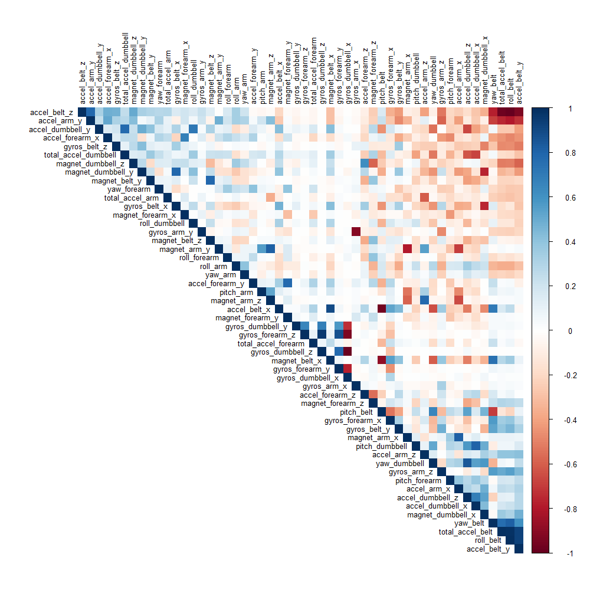
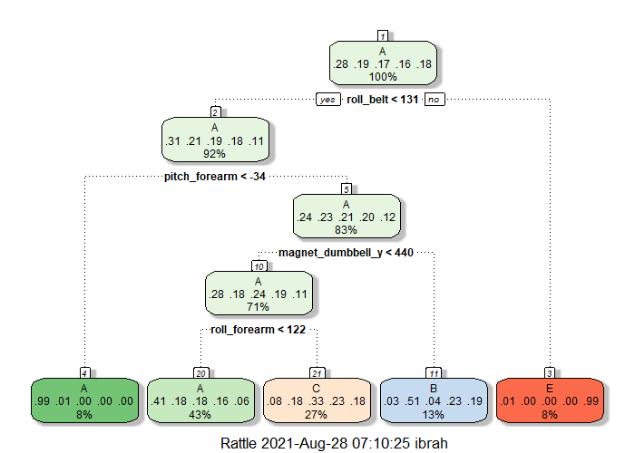
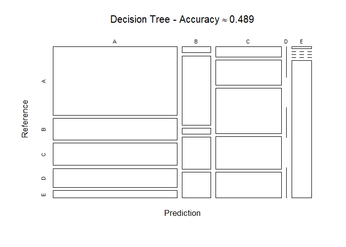
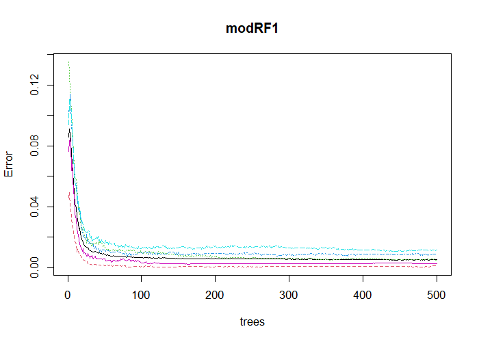
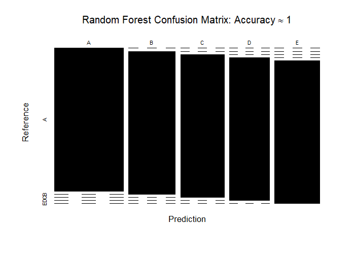
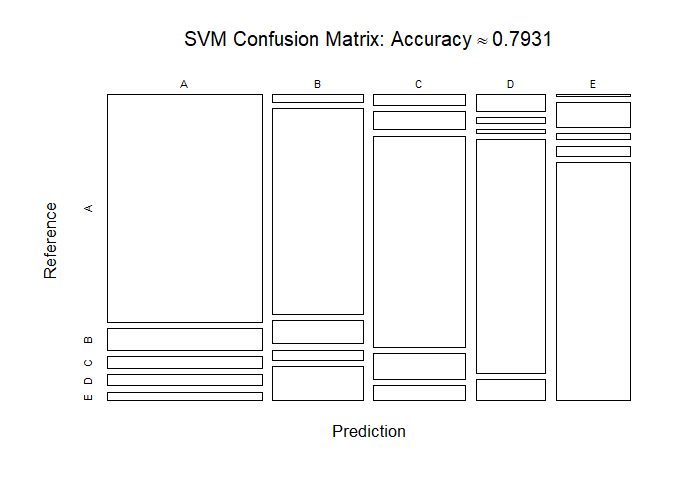

# Background
Using devices such as Jawbone Up, Nike FuelBand, and Fitbit it is now possible to collect a large amount of data about personal activity relatively inexpensively. These type of devices are part of the quantified self movement - a group of enthusiasts who take measurements about themselves regularly to improve their health, to find patterns in their behavior, or because they are tech geeks. One thing that people regularly do is quantify how much of a particular activity they do, but they rarely quantify how well they do it. In this project, your goal will be to use data from accelerometers on the belt, forearm, arm, and dumbell of 6 participants. They were asked to perform barbell lifts correctly and incorrectly in 5 different ways. More information is available from the website here: (http://groupware.les.inf.puc-rio.br/har) (see the section on the Weight Lifting Exercise Dataset).

The training data for this project are available [here](https://d396qusza40orc.cloudfront.net/predmachlearn/pml-training.csv)

The test data are available 
[here](https://d396qusza40orc.cloudfront.net/predmachlearn/pml-testing.csv)

The data for this project come from this source: http://web.archive.org/web/20161224072740/http:/groupware.les.inf.puc-rio.br/har. If you use the document you create for this class for any purpose please cite them as they have been very generous in allowing their data to be used for this kind of assignment.


### What you should submit  

The goal of your project is to predict the manner in which they did the exercise. This is the "classe" variable in the training set. You may use any of the other variables to predict with. You should create a report describing how you built your model, how you used cross validation, what you think the expected out of sample error is, and why you made the choices you did. You will also use your prediction model to predict 20 different test cases. 


### Read train and test input data

```r
Ori_training <- read.csv(
  url('https://d396qusza40orc.cloudfront.net/predmachlearn/pml-training.csv'))
Ori_testing <- read.csv(url('https://d396qusza40orc.cloudfront.net/predmachlearn/pml-testing.csv'))
write.csv(Ori_training,'./data/pml-training.csv'); rm(Ori_training)
write.csv(Ori_testing,'./data/pml-testing.csv');rm(Ori_testing)
train_in <- read.csv('./data/pml-training.csv', header=T)[,-c(1:8)]
valid_in <- read.csv('./data/pml-testing.csv', header=T)[,-c(1:8)]
```


### Data preprocessing: 


```r
# Data partitioning:
trainData <- train_in[, colSums(is.na(train_in)) == 0]
validData <- valid_in[, colSums(is.na(valid_in)) == 0]
set.seed(1234) 
inTrain <- createDataPartition(trainData$classe, p = 0.7, list = FALSE)
trainData <- trainData[inTrain, ]
testData <- trainData[-inTrain, ]

# remove near zero value
NZV <- nearZeroVar(trainData)
trainData <- trainData[, -NZV]
testData  <- testData[, -NZV]

dim(trainData)
```

```
## [1] 13737    53
```

```r
dim(testData)
```

```
## [1] 4123   53
```


#### The following correlation plot uses the following parameters (source: CRAN Package ***‘corrplot’***):  
* **“FPC”:** the first principal component order.  
* **“AOE”:** the angular order.  
* **“tl.cex”:** Numeric, for the size of text label (variable names).  
* **“tl.col”:** The color of text label.  


```r
library(corrplot)
cor_mat <- cor(trainData[, -53])
corrplot(cor_mat, order = "FPC", method = "color", type = "upper", 
         tl.cex = 0.8, tl.col = rgb(0, 0, 0))
```

<!-- -->

To obtain the names of the variables we do the following: we use the findCorrelation function to search for highly correlated attributes with a cut off equal to **0.75**.  


```r
highlyCorrelated = findCorrelation(cor_mat, cutoff=0.75)
```
We then obtain the names of highly correlated attributes  

```r
names(trainData)[highlyCorrelated]
```

```
##  [1] "accel_belt_z"      "roll_belt"         "accel_belt_y"      "total_accel_belt"  "accel_dumbbell_z" 
##  [6] "accel_belt_x"      "pitch_belt"        "magnet_dumbbell_x" "accel_dumbbell_y"  "magnet_dumbbell_y"
## [11] "accel_dumbbell_x"  "accel_arm_x"       "accel_arm_z"       "magnet_arm_y"      "magnet_belt_z"    
## [16] "accel_forearm_y"   "gyros_forearm_y"   "gyros_dumbbell_x"  "gyros_dumbbell_z"  "gyros_arm_x"
```


---

# Model creation:
For this project we will use two different algorithms, classification trees and random forests, to predict the outcome.

* classification trees
* random forests
* support vector machine


```r
control <- trainControl(method="cv", number=3, verboseIter=F)
```

### Prediction with classification trees
We first obtail the model, and then we use the fancyRpartPlot() function to plot the classification tree as a dendogram.

```r
set.seed(12345)
library(rpart)
library(rpart.plot)
library(rattle)
decisionTreeMod1 <- train(classe ~ ., data=trainData, trControl = control, method="rpart", tuneLength = 5)
fancyRpartPlot(decisionTreeMod1$finalModel)
```

<!-- -->

We then validate the model “decisionTreeModel” on the testData to find out how well it performs by looking at the accuracy variable.


```r
predictTreeMod1 <- predict(decisionTreeMod1, testData)
cmtree <- confusionMatrix(predictTreeMod1, factor(testData$classe))
cmtree
```

```
## Confusion Matrix and Statistics
## 
##           Reference
## Prediction    A    B    C    D    E
##          A 1058  336  346  292  117
##          B   21  245   22  113   91
##          C   82  206  370  267  210
##          D    0    0    0    0    0
##          E    4    0    0    0  343
## 
## Overall Statistics
##                                           
##                Accuracy : 0.489           
##                  95% CI : (0.4736, 0.5043)
##     No Information Rate : 0.2826          
##     P-Value [Acc > NIR] : < 2.2e-16       
##                                           
##                   Kappa : 0.3321          
##                                           
##  Mcnemar's Test P-Value : NA              
## 
## Statistics by Class:
## 
##                      Class: A Class: B Class: C Class: D Class: E
## Sensitivity            0.9082  0.31131  0.50136    0.000  0.45072
## Specificity            0.6312  0.92596  0.77400    1.000  0.99881
## Pos Pred Value         0.4923  0.49797  0.32599      NaN  0.98847
## Neg Pred Value         0.9458  0.85073  0.87684    0.837  0.88930
## Prevalence             0.2826  0.19088  0.17900    0.163  0.18457
## Detection Rate         0.2566  0.05942  0.08974    0.000  0.08319
## Detection Prevalence   0.5212  0.11933  0.27528    0.000  0.08416
## Balanced Accuracy      0.7697  0.61863  0.63768    0.500  0.72477
```

plot matrix results

```r
# plot matrix results
plot(cmtree$table, col = cmtree$byClass, 
     # main = paste("Decision Tree - Accuracy =", round(cmtree$overall['Accuracy'], 4))
     main=bquote(paste("Decision Tree - Accuracy", NULL%~~%NULL,
                         .(round(cmtree$overall['Accuracy'], 4))))
     )
```

<!-- -->
  
We see that the accuracy rate of the model is low: **0.489**  and therefore the out-of-sample-error is considerable.


### Prediction with Random Forest
We first determine the model

```r
library(randomForest)
modRF1 <- randomForest(as.factor(classe) ~ ., data = trainData, importance=TRUE)
```

We then validate the model obtained model “modRF1” on the test data to find out how well it performs by looking at the Accuracy variable

```r
predictRF1 <- predict(modRF1, newdata=testData)
cmrf <- confusionMatrix(predictRF1, factor(testData$classe))
cmrf
```

```
## Confusion Matrix and Statistics
## 
##           Reference
## Prediction    A    B    C    D    E
##          A 1165    0    0    0    0
##          B    0  787    0    0    0
##          C    0    0  738    0    0
##          D    0    0    0  672    0
##          E    0    0    0    0  761
## 
## Overall Statistics
##                                      
##                Accuracy : 1          
##                  95% CI : (0.9991, 1)
##     No Information Rate : 0.2826     
##     P-Value [Acc > NIR] : < 2.2e-16  
##                                      
##                   Kappa : 1          
##                                      
##  Mcnemar's Test P-Value : NA         
## 
## Statistics by Class:
## 
##                      Class: A Class: B Class: C Class: D Class: E
## Sensitivity            1.0000   1.0000    1.000    1.000   1.0000
## Specificity            1.0000   1.0000    1.000    1.000   1.0000
## Pos Pred Value         1.0000   1.0000    1.000    1.000   1.0000
## Neg Pred Value         1.0000   1.0000    1.000    1.000   1.0000
## Prevalence             0.2826   0.1909    0.179    0.163   0.1846
## Detection Rate         0.2826   0.1909    0.179    0.163   0.1846
## Detection Prevalence   0.2826   0.1909    0.179    0.163   0.1846
## Balanced Accuracy      1.0000   1.0000    1.000    1.000   1.0000
```

##### The accuracy rate using the random forest is very high: Accuracy $\approx$ 1 and therefore the out-of-sample-error is equal to 0***. But it might be due to overfitting.

#### **Let’s plot the Random forest model**

```r
plot(modRF1)
```

<!-- -->

```r
plot(cmrf$table, col = cmrf$byClass,
      main=bquote(paste("Random Forest Confusion Matrix: Accuracy", NULL%~~%NULL,
                         .(round(cmrf$overall['Accuracy'],4))))
     )
```

<!-- -->

##### The accuracy rate using the random forest is very high: Accuracy $\approx$ 1 

### Prediction with support vector machine:

```r
mod_svm <- train(classe~., data=trainData, method="svmLinear", trControl = control, tuneLength = 5, verbose = F)
```


```r
pred_svm <- predict(mod_svm, testData)
cmsvm <- confusionMatrix(pred_svm, factor(testData$classe))
cmsvm
```

```
## Confusion Matrix and Statistics
## 
##           Reference
## Prediction    A    B    C    D    E
##          A 1076  100   59   53   41
##          B   21  568   64   29   94
##          C   29   52  592   71   43
##          D   35   12    8  496   45
##          E    4   55   15   23  538
## 
## Overall Statistics
##                                           
##                Accuracy : 0.7931          
##                  95% CI : (0.7804, 0.8054)
##     No Information Rate : 0.2826          
##     P-Value [Acc > NIR] : < 2.2e-16       
##                                           
##                   Kappa : 0.7371          
##                                           
##  Mcnemar's Test P-Value : < 2.2e-16       
## 
## Statistics by Class:
## 
##                      Class: A Class: B Class: C Class: D Class: E
## Sensitivity            0.9236   0.7217   0.8022   0.7381   0.7070
## Specificity            0.9145   0.9376   0.9424   0.9710   0.9711
## Pos Pred Value         0.8096   0.7320   0.7522   0.8322   0.8472
## Neg Pred Value         0.9681   0.9346   0.9562   0.9501   0.9361
## Prevalence             0.2826   0.1909   0.1790   0.1630   0.1846
## Detection Rate         0.2610   0.1378   0.1436   0.1203   0.1305
## Detection Prevalence   0.3223   0.1882   0.1909   0.1446   0.1540
## Balanced Accuracy      0.9190   0.8297   0.8723   0.8546   0.8391
```

#### **Let’s plot the SVM model**

```r
plot(cmsvm$table, col = cmsvm$byClass,
      main=bquote(paste("SVM Confusion Matrix: Accuracy", NULL%~~%NULL,
                         .(round(cmsvm$overall['Accuracy'],4))))
     )
```

<!-- -->

## **Applying the best model to the validation data**  
  
##### By comparing the accuracy rate values of the three models, it is clear the the **‘Random Forest’** model is the winner. So will use it on the validation data

```r
Results <- predict(modRF1, newdata=validData)
Results
```

```
##  1  2  3  4  5  6  7  8  9 10 11 12 13 14 15 16 17 18 19 20 
##  B  A  B  A  A  E  D  B  A  A  B  C  B  A  E  E  A  B  B  B 
## Levels: A B C D E
```
